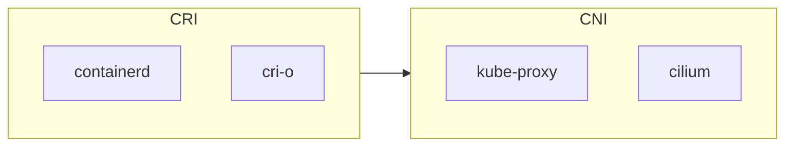
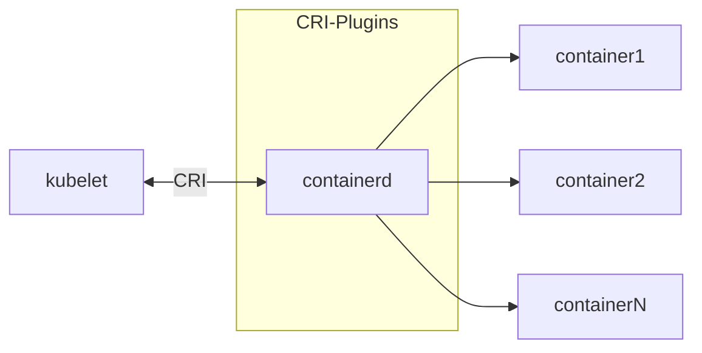

# Kubernetes Deploy

## 更新日志

1. 更新: v2.0.0-rc的ctr默认生成的配置文件中的sandbox_image字段已改成sandbox

## 阶段

目前处在`PRE`初始阶段, 正在快速迭代, 仅在本机MAC环境的aarch64的Ubuntu2.04的虚拟机上测试运行

## 专业名词

1. CRI:
    1. Cilium
    2. Kube-proxy
2. CNI:
    1. Containerd:
    2. CRI-O:
    3.

## 介绍

该仓库旨在快速在Ubuntu一键部署创建一个全新的一个单节点的控制平面

与本仓库同步的文章: https://juejin.cn/post/7292041370893778983

### 本项目支持的Kubernetes版本:

1. kubernetes 1.25.X
2. kubernetes 1.26.X
3. kubernetes 1.27.X
4. kubernetes 1.28.X
5. kubernetes 1.29.X

### 本项目支持的[CRI]():

1. Containerd(Stable)
2. CRI-O(RC)

### 本项目支持的[CNI](https://kubernetes.io/docs/concepts/cluster-administration/addons/#networking-and-network-policy):

1. Kube-proxy(Stable)
2. Cilium(Beta)

## 说明

目录说明:

| 目录                     | 角色            | 作用                   | 备注                                      |
|------------------------|---------------|----------------------|-----------------------------------------|
| 01-base-env            | ALL           | 安装与配置Kubernetes所需的环境 | 当前仅适用于Ubuntu发行版                         |
| 02-CRI                 | ALL           | 安装与配置CRI容器运行时        | 当前只适配Containerd                         |
| 03-CNI                 |               | 安装与配置CNI             | 如果是kube-proxy组件,则需要安装                   |
| 04-cgroup              | ALL           | 配置cgroup             | 当前仅适用于Ubuntu发行版                         |
| 05-crictl              | Control plane | 安装与配置crictl          | 二进制安装需要单独安装, 包管理器安装的方式已经安装该工具. 但它们都需要配置 |
| 06-apt-init-components | ALL           | 安装Kubernetes组件与初始化集群 | 当前仅适合Ubuntu                             |

## 架构



## 注意事项

1. 你需要查看shell的内容, 里面大多包含注释和注意事项
2. 该仓库的脚本不适合用于生产环境的部署, 尽管这些脚本经过本人验证
3. 该项目未对shell脚本进行更多的健壮性校验

### [Containerd](https://github.com/containerd/containerd/tree/main?tab=readme-ov-file#runtime-requirements)

1. 二进制Containerd的安装方式不适用与基于 musl 的发行版，例如 Alpine Linux,此类发行版的用户可能必须从源代码或第三方软件包安装
   containerd
   参阅[Installing containerd](https://github.com/containerd/containerd/blob/main/docs/getting-started.md)
2. containerd 核心代码和快照程序使用的特定功能需要 Linux 上的最低内核版本。根据发行版内核版本控制的明确要求，Linux
   的合理起点是最低 4.x 内核版本
3. 默认情况下使用的覆盖文件系统快照器使用 4.x 内核系列中最终确定的功能。如果您选择使用 btrfs，内核版本可能会有更大的灵活性（建议的最低版本为
   3.18），但需要在 Linux 发行版上安装 btrfs 内核模块和 btrfs 工具。

## 使用

在目标服务器安装:

```shell
git clone --depth 1 https://github.com/Mandala-lab/Kubernetes.git
```

### Master 控制平面

#### Cilium

##### 介绍

Cilium 是一种网络、可观测性和安全解决方案，具有基于 eBPF 的数据平面。
Cilium 提供了一个简单的扁平第 3 层网络，能够以本机路由或叠加/封装模式跨越多个集群，
并且可以使用与网络寻址分离的基于身份的安全模型在 L3-L7 上实施网络策略。
Cilium 可以作为 kube-proxy 的替代品;它还提供额外的、选择加入的可观测性和安全功能。
Cilium 是 CNCF 的毕业项目

##### 要求

1. Kubernetes 必须配置为使用 CNI（请参阅网络插件要求）
2. Linux 内核 >= 4.9.17

##### Base 基本安装

chmod +x ./base-env-apt-cilium-install.sh
./base-env-apt-cilium-install.sh

### Worknode 工作节点

## 架构

### CRI



## 局限性

1. 目前仅在Ubuntu22.04上进行开发和测试
2. 需要在拥有管理员执行的权限才可以运行shell scripts
3. 本集群是在管理员权限的情况下部署, 不适用于对安全性有苛刻要求的环境

## 资料

1. https://kubernetes.io/docs/tasks/tools/install-kubectl-linux/
2. https://kubernetes.io/docs/setup/production-environment/tools/kubeadm/install-kubeadm/#installing-kubeadm-kubelet-and-kubectl
